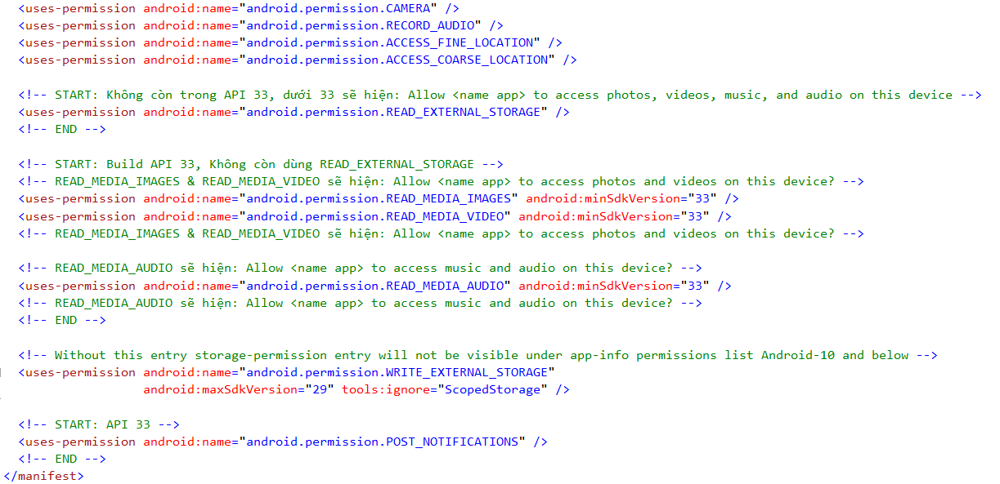

# Requesting Permissions trên Phone (Platform Android) 
## Unity version: 2020.3.48f1 (C#)

## Các permissions đang sử dụng trong code (AndroidManifest.xml)

- android.permission.CAMERA
- android.permission.RECORD_AUDIO
- android.permission.ACCESS_FINE_LOCATION
- android.permission.ACCESS_COARSE_LOCATION
- android.permission.READ_EXTERNAL_STORAGE
- android.permission.READ_MEDIA_IMAGES
- android.permission.READ_MEDIA_VIDEO
- android.permission.READ_MEDIA_AUDIO
- android.permission.WRITE_EXTERNAL_STORAGE
- android.permission.POST_NOTIFICATIONS

##### Lưu ý:

__Để hiển thị thông báo cần:__ 
```
<!-- START: Thêm vào để hiện thông báo -->
<meta-data android:name="unityplayer.SkipPermissionsDialog" android:value="true" />
<!-- END -->
```

__Khi sử dụng:__ _WRITE_EXTERNAL_STORAGE phải có android:requestLegacyExternalStorage="true"_




## License

MIT

**Kitajima2910, 2023-06-22**
